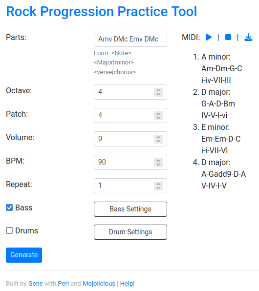

# Rock::Tool

Rock Chord Progression Practice Tool

To install, have [Perl](https://www.perl.org/) and [cpanm](https://foswiki.org/Support/HowToInstallCpanModules#Install_CPAN_modules_into_your_local_Perl_library_using_61App::cpanminus_61), then:

    git clone https://github.com/ology/Rock-Tool.git
    cd Rock-Tool
    cpanm --installdeps .
    morbo rocktool.pl

Then browse to http://localhost:3000/ - Voila!

